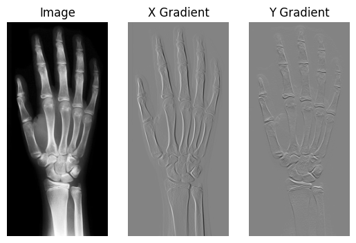
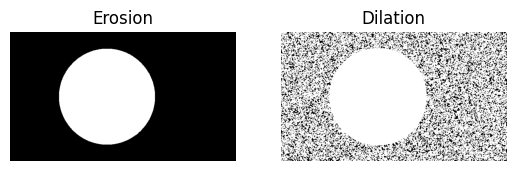
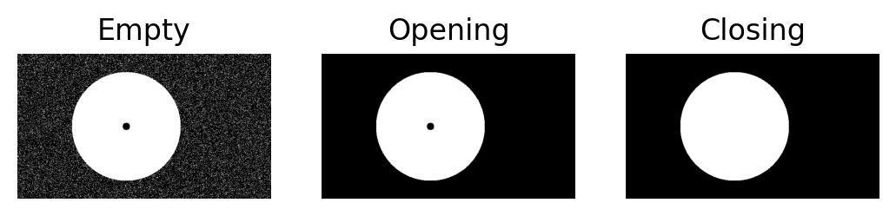

# Laboratory 1 - Basic Operations, Gradient, Binary Images, Morhpology

This laboratory focuses on learning how to deal with basic input/output operations for 2D images, NumPy arrays, gradients, binary images and morphology operations.

This purpose of this notebook was to learn.

## Gradient operations

The goal was to operate on image below and recreate gradients.

The difference between created function for gradient and using preexisting ones is equal to 0.

## Morphological operations
Below you can see implemented functions for recreating erosion and dilation.

Below morhpological opening and closing.

## Summary
The results are all correct.