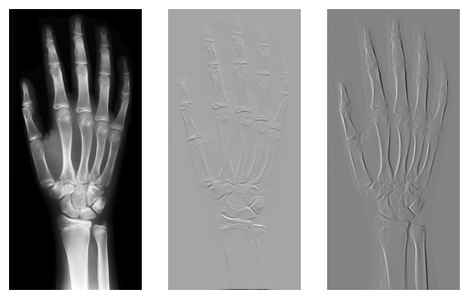

# Laboratory 2 - PyTorch, Convolution and Correlation, Filtering, Simple Neural Networks

This laboratory focuses on learning how PyTorch works, 2D correlation/convolution implementation, CPU vs GPU execution and simple ANN implementation.

## Convolution and Correlation
The most important aspect is to understand the convolution process. In 2D, given some mask (kernel), with same or less dimentions as our matrix, we apply it for every element to our matrix, sum these elements and return a value to appropriate place in matrix.

## Filtering
We can apply a filter the same way as our convolution but use different kernel to get different results, like simulate gradient with Sobel operator.



## Execution time
This section presents why exactly PyTorch is useful. It may not have fastest or the most optimized code, but its main purpose is for GPU using CUDA implementation.

I used Google Colab for GPU, because I do not have dedicated GPU.

Results for GPU
```
2.11 ms ± 65 µs per loop (mean ± std. dev. of 7 runs, 100 loops each)  
```

Results for CPU
```
39.9 µs ± 47.9 µs per loop (mean ± std. dev. of 7 runs, 1 loop each)
```

Speed-up: 52.88 times.

## Fully Connected Networks
This part is nothing impresive, just how to create fully connected networks using PyTorch.

```
Network summary: 
----------------------------------------------------------------
        Layer (type)               Output Shape         Param #
================================================================
            Linear-1               [-1, 4, 128]          16,512
              ReLU-2               [-1, 4, 128]               0
            Linear-3                [-1, 4, 64]           8,256
              ReLU-4                [-1, 4, 64]               0
            Linear-5                 [-1, 4, 2]             130
           Sigmoid-6                 [-1, 4, 2]               0
================================================================
Total params: 24,898
Trainable params: 24,898
Non-trainable params: 0
----------------------------------------------------------------

```

## Convolutional Neural Networks
Same as section before, but using convolutional layers.

```
Network summary: 
----------------------------------------------------------------
        Layer (type)               Output Shape         Param #
================================================================
            Conv2d-1         [-1, 32, 224, 224]             896
              ReLU-2         [-1, 32, 224, 224]               0
            Conv2d-3         [-1, 64, 113, 113]          18,496
              ReLU-4         [-1, 64, 113, 113]               0
            Conv2d-5        [-1, 128, 113, 113]          73,856
              ReLU-6        [-1, 128, 113, 113]               0
            Conv2d-7          [-1, 128, 58, 58]         147,584
              ReLU-8          [-1, 128, 58, 58]               0
 AdaptiveAvgPool2d-9            [-1, 128, 1, 1]               0
================================================================
Total params: 240,832
Trainable params: 240,832
Non-trainable params: 0
----------------------------------------------------------------
```

## Summary
The results are all correct