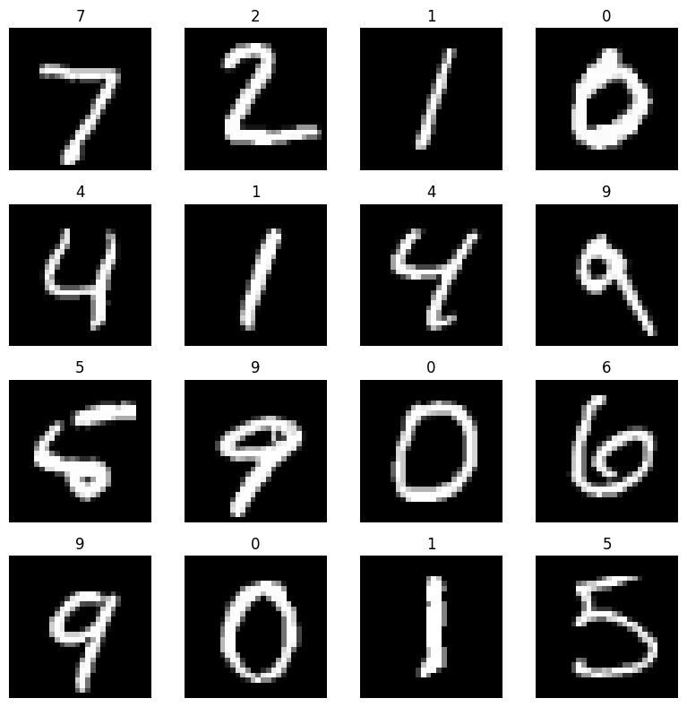
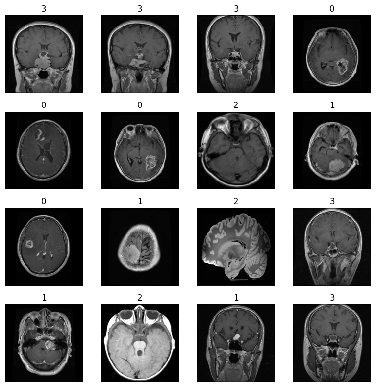
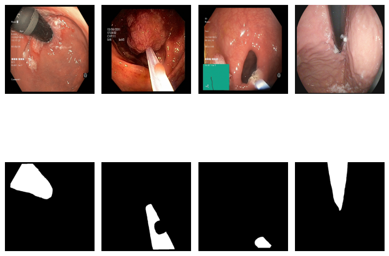

# Laboratory 3 - Datasets, Dataloaders

This laboratory focuses on learning how to load images using I/O libraries, how to implement several datasets/dataloaders in PyTorch and how do they work.

## **Warning!**  
In this laboratiories we use images from endoscopy which some people find disturbing.

## Basic Dataloaders
Use of torchvision, creating the Dataset and Dataloader derived from the Dataset for MNIST dataset.

## MRI Dataloader (simple)
Creating our Dataset with Brain_MRI dataset available from https://www.kaggle.com/datasets/sartajbhuvaji/brain-tumor-classification-mri?resource=download.

There are also instruction on how to mount the Google drive to colab notebook.

## MRI Dataloader (extended)
Improving on previous dataloader for general purpose.

## Endoscopy Dataloader
Using knowledge from implementing previous Dataloaders create new one using endoscopy images.
Dataset location: https://www.kaggle.com/datasets/debeshjha1/kvasirinstrument

## Summary
The results are all correct