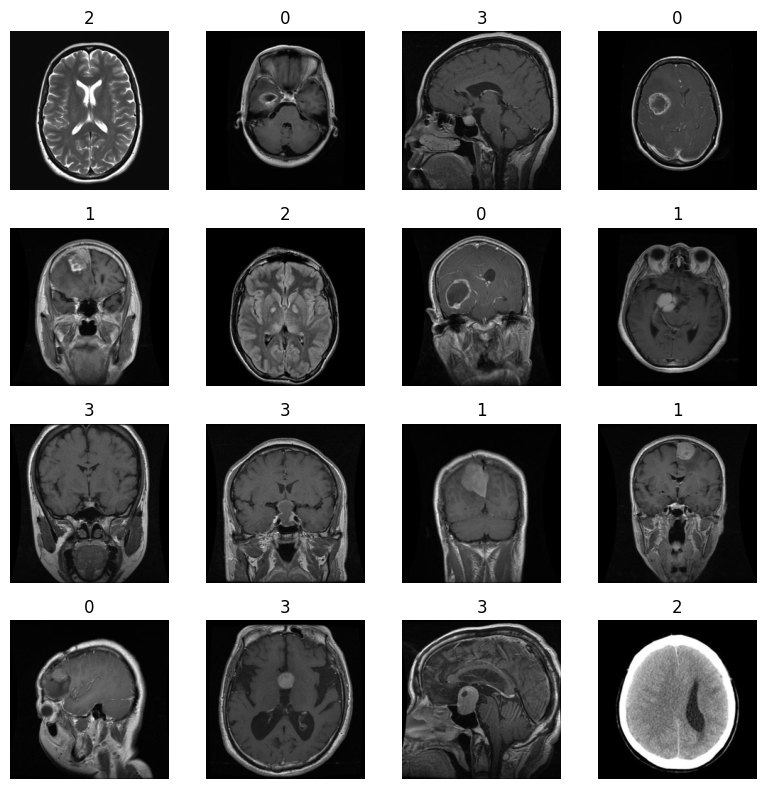
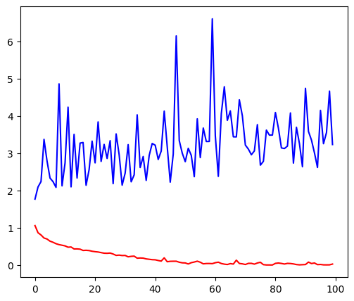
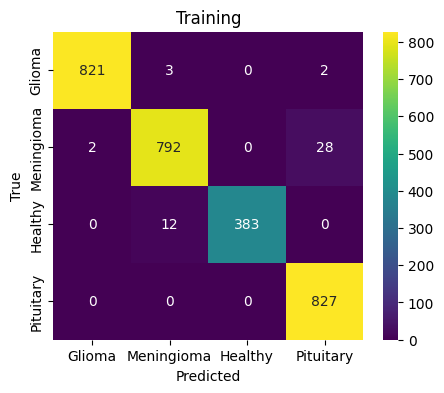
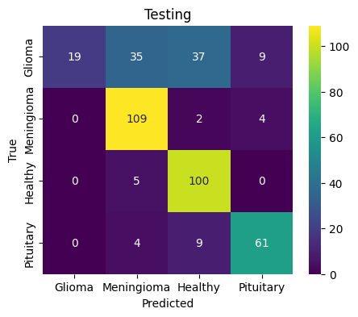
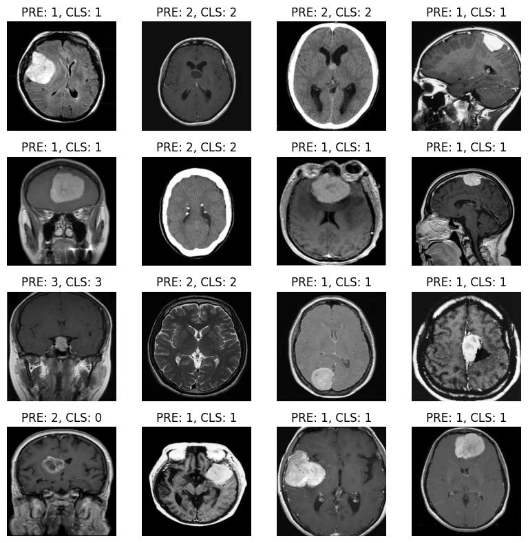

# Laboratory 4 - Neural Netoworks Training - Supervised

This laboratory focuses on learning how to implement gradient descent algorithm, how training of ANN looks like. At last the training of brain tumors in MRI images was performed. It is important to understand the training hyperparameters like batch size, number of epochs and learning rate.

Most of this notebook was prepared locally on CPU and executed on GPU later on Google Colab.

## Gradient Descent
Implementation of gradient descent with different learning rates:

*lr=0.01*
```
Result: tensor([-0.0005, -0.0005]), Value of the function at the result: 0.5136600136756897
```

*lr=0.1*
```
Result: tensor([-0.0005, -0.0005]), Value of the function at the result: 5.279753167997114e-07
```

*lr=10*
```
Result: tensor([-0.0005, -0.0005]), Value of the function at the result: 94224613376.0
```

## Convolutional Neural Network
Implementation of a CNN

```
Network summary: 
----------------------------------------------------------------
        Layer (type)               Output Shape         Param #
================================================================
            Conv2d-1         [-1, 32, 224, 224]             320
       BatchNorm2d-2         [-1, 32, 224, 224]              64
              ReLU-3         [-1, 32, 224, 224]               0
            Conv2d-4         [-1, 64, 113, 113]          18,496
       BatchNorm2d-5         [-1, 64, 113, 113]             128
              ReLU-6         [-1, 64, 113, 113]               0
            Conv2d-7         [-1, 64, 113, 113]          36,928
       BatchNorm2d-8         [-1, 64, 113, 113]             128
              ReLU-9         [-1, 64, 113, 113]               0
           Conv2d-10           [-1, 64, 58, 58]          36,928
      BatchNorm2d-11           [-1, 64, 58, 58]             128
             ReLU-12           [-1, 64, 58, 58]               0
           Conv2d-13           [-1, 64, 30, 30]          36,928
      BatchNorm2d-14           [-1, 64, 30, 30]             128
             ReLU-15           [-1, 64, 30, 30]               0
           Conv2d-16           [-1, 64, 15, 15]          36,928
      BatchNorm2d-17           [-1, 64, 15, 15]             128
             ReLU-18           [-1, 64, 15, 15]               0
AdaptiveAvgPool2d-19             [-1, 64, 1, 1]               0
          Flatten-20                   [-1, 64]               0
           Linear-21                   [-1, 64]           4,160
             ReLU-22                   [-1, 64]               0
           Linear-23                   [-1, 64]           4,160
             ReLU-24                   [-1, 64]               0
           Linear-25                    [-1, 4]             260
================================================================
Total params: 175,812
Trainable params: 175,812
Non-trainable params: 0
----------------------------------------------------------------
```

## Dataset, Dataloader
Using the Lab3 dataset and created dataloader for MRI images.

 
 
## Network Training
Now, for this part, the training function was implemented.
Later, the training was performed.

Last epochs:
```
Current epoch: 97
100%|██████████| 90/90 [00:54<00:00,  1.64it/s]
Current epoch training loss: 0.006684740082983849
Current epoch testing loss: 3.553922459558787
Current epoch: 98
100%|██████████| 90/90 [00:54<00:00,  1.65it/s]
Current epoch training loss: 0.007627334139303333
Current epoch testing loss: 4.665227260686419
Current epoch: 99
100%|██████████| 90/90 [00:57<00:00,  1.57it/s]
Current epoch training loss: 0.02870393883297382
Current epoch testing loss: 3.232967595763618
```

Visualization of the loss:


## Result analysis




The loss is unreasonably high despite results being quite acceptable. We can see though, that often model predicts a class as Glioma despite it being different class. This may suggest high similarity to other classes.

Sample of our predictions:


## Summary
The results are fine, but could be better. Possibly, there were some mistakes during implementation. It is recommended to tweak hyperparameters for better performance.