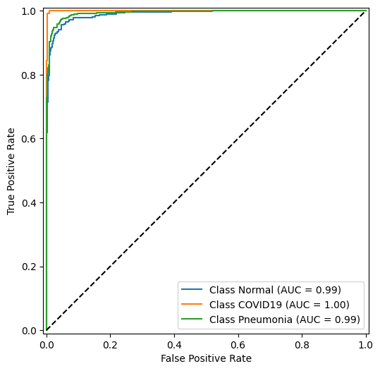

# Laboratory 5 - Classification, Classification Networks, Transfer Learning

This laboratory focuses on problem of image classification. There are introduced new concepts like image augmentation into dataloader, tensorboard logging, using transfer learning with ResNet18 architecture and analyzing classification results with ROC/AUC and confusion matrices.

Dataset used: https://www.kaggle.com/datasets/prashant268/chest-xray-covid19-pneumonia

## Google drive mount
For faster learning I used Google colab, where mounting a drive is a simple and fast way to create a link between your cloud files.

## XRay Dataloader
Implementation of the dataset dataloader. It included normal, pneumonia and COVID19 cases. We divide the dataset into training, validating and testing sub-datasets.

Simple visualization:

## Dataloader Extension - Basic Augmentation
To increase the generalization of our model we introduce a model augmentation - some transformation of the image.

 
## ResNet18 - Fine-Tuning
It is possible to download pretrained model (download model weights) of ResNet, a popular architecture for classification that uses skip connections.

There, we compared three approaches: 
1. Training ResNet from scratch
2. Training ResNet pretrained with all layers unfrozen
3. Training ResNet pretrained with last layer unfrozen

ResNet weights: https://pytorch.org/hub/pytorch_vision_resnet/

Here we use the tensorboard too, but in my case, tensorboard was mostly inactive, or active in just Google Colab. Later in the span of this course I tried using Kaggle as the execution environment - there tensorboard didn't work for me at all.

I tuned/trained for each version of ResNet.

## Result Analysis

**ResNet from scratch**

**ResNet pretrained with all layers unfrozen**

**ResNet pretrained with last layer unfrozen**

Results are actually extremely similar. The author of this notebook did not originally achieve this accuracy, which was presented in initial plot. However these models differ only slightly, with AUC being very close to 1, or equal to it.

However, it is clear, that there is a class imbalance, which causes the Normal and Pneumonia cases to be mixed, but rarely with COVID.

## Summary
In my case, the results were very good. The covid case has the best ROC curve of all classes, and even though the finetuned model has the worst performance, the difference is probably neglectable. I have double checked and it seems like there was no overlap in testing and training data.