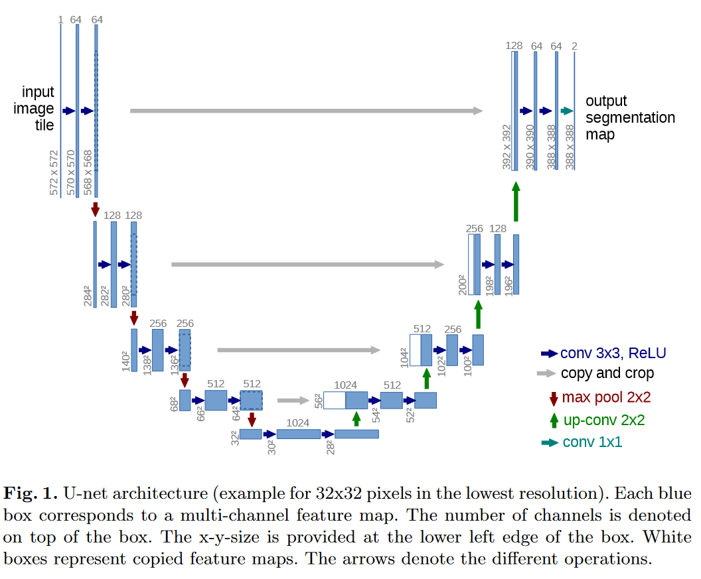
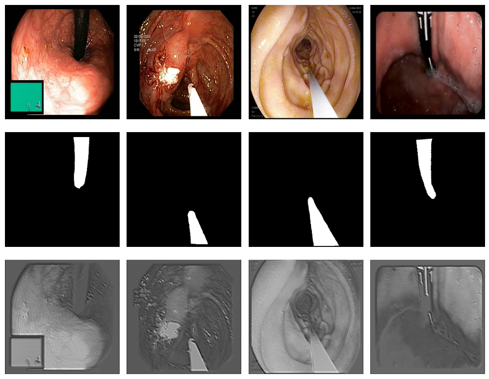
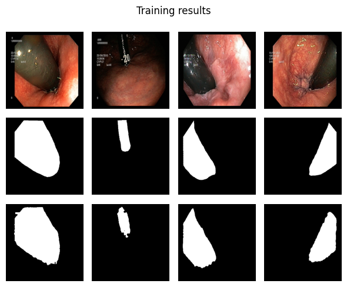
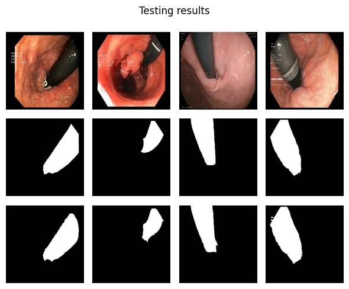

# Laboratory 6 - Image Segmentation, Encoder-Decoder, UNet

This laboratory focuses on problem of image segmentation using Encoder-Decoder architecture like UNet.

## **Warning!**  
In this laboratiories we use images from endoscopy which some people find disturbing.

## Dataset and Dataloader
We use previously implemented dataset and dataloader (lab3) with endoscopy data.

## Neural Network Architecture (UNet)
We used for implementation the original paper: https://arxiv.org/pdf/1505.04597.pdf



The implementation is long and tedious, so check out original notebook if you are more interested.

Next, I have verified that this network actually work, and with untrained model visualized results with their according labels:



The last row represents what model actually produces.

## Neural Network Training
This part is related to training. We have split the data to train/valid/test and trained for 59 epochs, until I have decided manually to stop the training session. On GPU one epoch was executing around 9 minutes, which meant training for almost 9 hours.

This meant that I was nearly coming to the limit what free Google Colab has to offer (12 hours per notebook).

## Evaluation and Results Analysis
Using popular metrics in image segmentation (reference of lecture and article: https://arxiv.org/abs/2206.01653). Metrics are Dice Coefficient, which is an F1-score measuring volumetric agreement, and Hausdorff distance evaluating correspondance between edges. Hausdorff coef. is however prone to outliers, hence more reliable metric is using 95% of sorted values.

```
Testing Dice Mean: 0.893314581692631
Testing Dice Std: 0.15966760725301818
Testing Dice Min: 0.07078313253012049
Testing Dice Max: 0.9856447906407616

Testing HD95 Mean: 243.00205760445738
Testing HD95 Std: 5.684341886080802e-14
Testing HD95 Min: 243.00205760445732
Testing HD95 Max: 243.00205760445732
```

Showing the results may actually be somewhat more useful:



## Summary
Results after 59 epochs were actually quite good. Quantitatively, the results were significantly better for the training loss, so the model slightly might be overfitted, because the results were not getting better in validation. Testing Dice loss were around 0.89, so this is better than validation results (0.85).  

However, Actually visually the results are looking very good and overlay very similarly. We could improve results with maybe some parameter tuning and adding slight regularization combined with higher amount of epochs (in my case I ran 59 of them before stopping). 