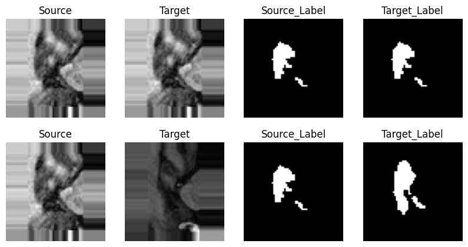
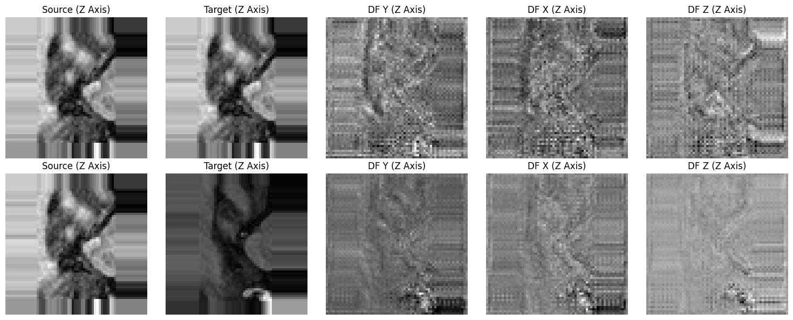
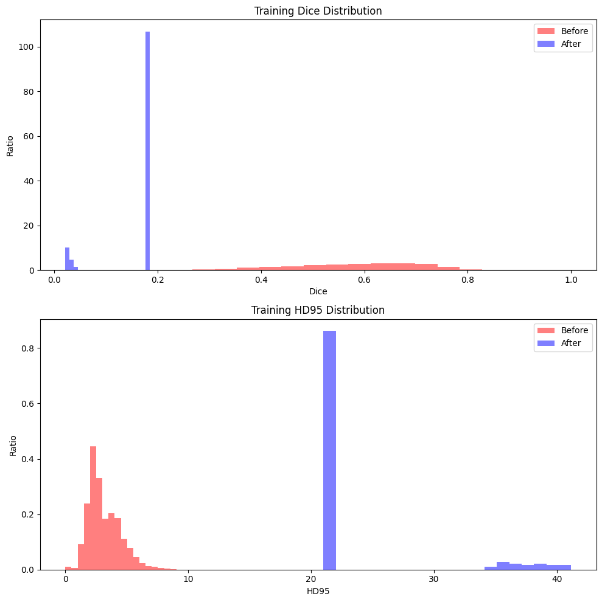
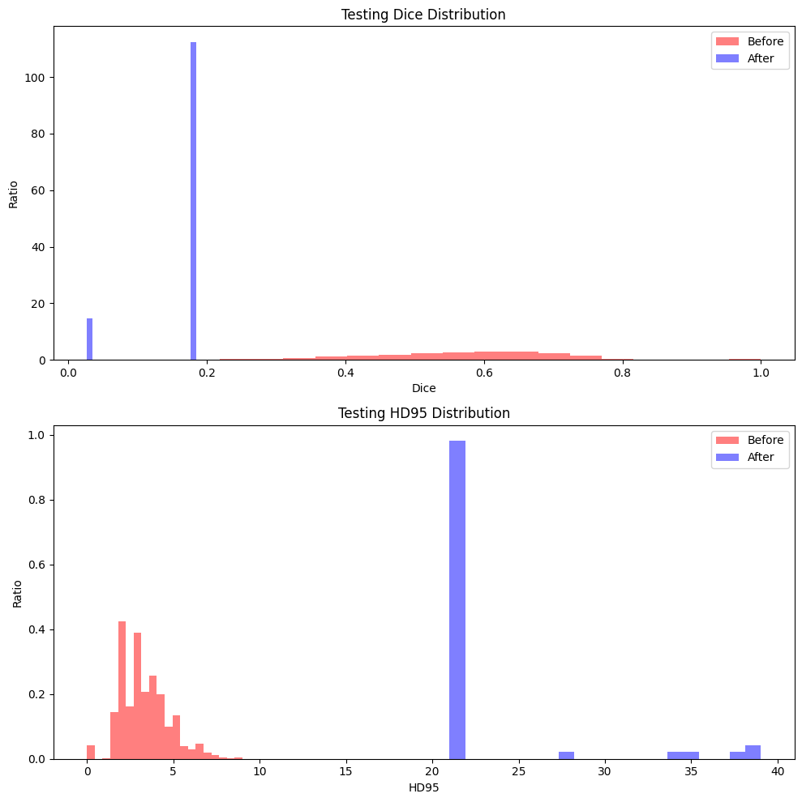

# Laboratory 7 - Medical Image Registration

This laboratory focuses on problem of image registration - task almost exclusively related to medical image analysis. Registration is about capturing the change in space between two objects. This notebook is not properly finished, was by far the most difficult, and I believe I have made some mistakes along the way.

Dataset: https://learn2reg.grand-challenge.org/Datasets/

This dataset contains hippocampus from various subjects. It contains volumetric data (3D). This task is very resource and time consuming, hence its best to use on GPU (Colab in my case).

## Dataset and Dataloader
Creating a dataset and dataloader was rather straight-forward with notebook instructions.

Next, we needed to modify our set slightly. It contained 260 cases in total, but when registering we wanted to test scenario all-vs-all. It created 36298 cases in total (32942 for training). 



On this image we can see source and target - two perspectives on hippocampus. The label is actually a segmentation of hippocampus. 

The goal is to implement an unsupervised training using these labels to transform the source images into target.

## Registration Architecture
We modify previous laboratories code - UNet for 2D into UNet for 3D with additional details.

Rough model output:


## Neural Network Training
As it was mentioned before, it will be unsupervised learning: without actual training labels for the downstream task.

The objective function for unsupervised image registration usually consists of the dissmilarity term and the regularization function. The regularization term is necessary because without any constraints the network would learn a "perfect mapping"

Unfortunately the training went quite wrong, possibly in improper implementation:

```
Epoch 1 val: 100%|██████████| 43/43 [00:23<00:00,  1.84it/s]
Epoch 1/10, Train Loss: 35.2659, Val Loss: 11.8261

Epoch 2 val: 100%|██████████| 43/43 [00:23<00:00,  1.85it/s]
Epoch 2/10, Train Loss: 23.5853, Val Loss: 40.1512

...

Epoch 9 val: 100%|██████████| 43/43 [00:23<00:00,  1.84it/s]
Epoch 9/10, Train Loss: 116.2753, Val Loss: 132.8869

Epoch 10 val: 100%|██████████| 43/43 [00:23<00:00,  1.83it/s]
Epoch 10/10, Train Loss: 115.8599, Val Loss: 231.3522
Ended training
```

The loss was increasing instead. This task is very time consuming (~40 minutes on Colab GPU, on local CPU around 2 hours - literally not possible to train).

## Evaluation and Results Analysis\
Same as in segmentation - Dice coefficient and 95th percentile of Hausdorff distance.

*Training set*


*Testing set*


It's clear that the results are completely wrong, worse than using the target photo itself. Warping and image results in a completely black image.

## Summary
These results are looking very incorrect. This could be due to problem in architecture, or in training, or both. The evaluations are not actually so obvious to come up with and probably needs more understanding.

Unfortunatelly, the dice coefficient suggests that the results are more similar to each other by them selves, than after my registration (which is understandable). Due to the time of the training (around 40 minutes per epoch on GPU and around 2h on CPU) it is very hard to determine the immediate results and how model performs.

