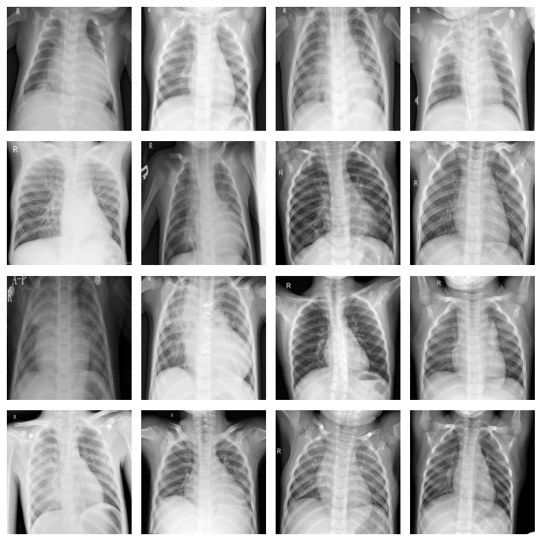
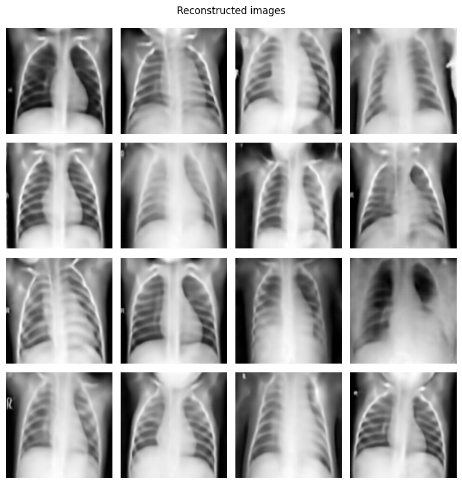
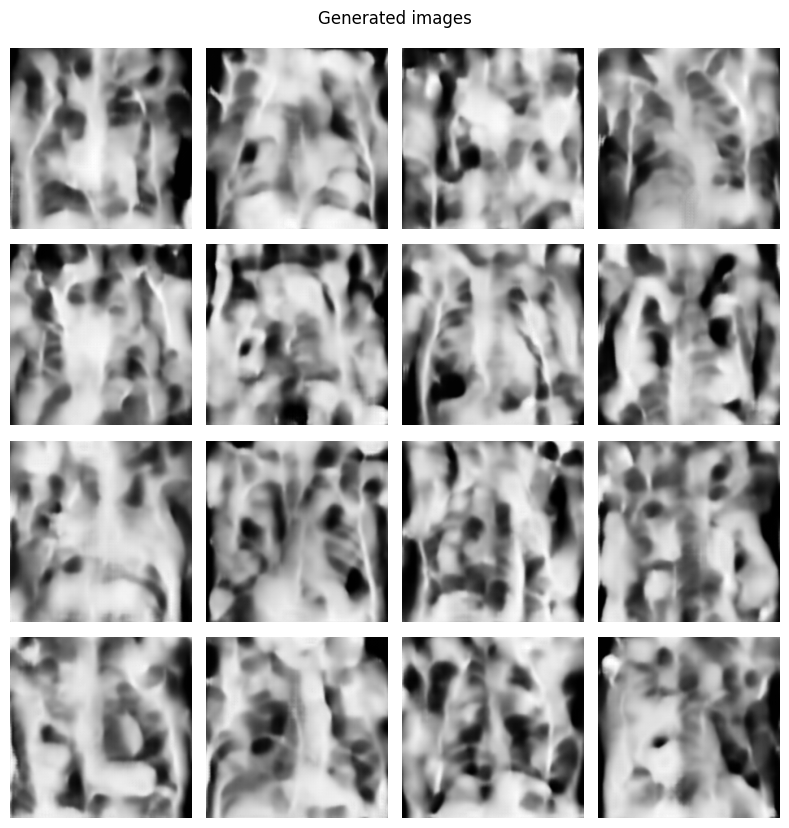
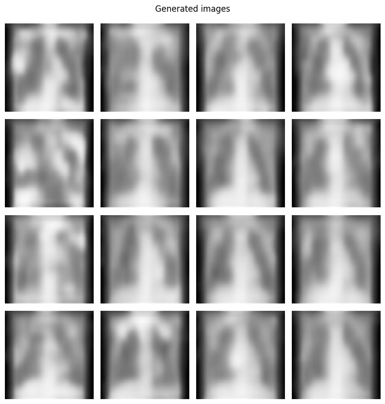

# Laboratory 8 - Medical Image Generation

This laboratory focuses on a problem of implementing medical image generation. We tackle Autoencoder and Variational-Autoencoder architectures, they are not as useful anymore, but a good example.

This notebook uses previously used dataset for XRay images of lungs: https://www.kaggle.com/datasets/prashant268/chest-xray-covid19-pneumonia

## Dataset and Dataloader
We slightly needed to modify the dataset implemented in lab5.



## Autoencoder
https://medium.com/ai%C2%B3-theory-practice-business/understanding-autoencoders-part-i-116ed2272d35

And article for understanding of autoencoders.

So, the implementation is a modified UNet from lab6.
Training session:
```
...

Epoch [49/50]
Loss: 0.0019

Epoch [50/50]
Loss: 0.0018

End of training.
```

Reconstructed images:


Generated images:


These reconstructeds images look awesome for the number of epochs. Generation actually needs more training, but looks promising. Again, this is not a task for a simple CPU to run in minutes, hence this can only be done in GPU in a reasonable time.

## Variational Autoencoder
https://medium.com/geekculture/variational-autoencoder-vae-9b8ce5475f68

Actually here, the idea is almost the same, but the latent space is represented as a normal distribution.

After implementation I started training session:

```
Epoch: [1/50]
Epoch loss:   126.51578526117315
Epoch r_loss: 0.037126551136671015
Epoch d_loss: 42159.552006811646

Epoch: [2/50]
Epoch loss:   9.619969174636537
Epoch r_loss: 0.030937366581415358
Epoch d_loss: 3196.343900614117

...

Epoch: [9/50]
Epoch loss:   4.732164159936098
Epoch r_loss: 0.028933975354430094
Epoch d_loss: 1567.7433796593207

Epoch: [10/50]
Epoch batch 205 loss:   inf
Epoch batch 205 r_loss: 6.026006197556853
Epoch batch 205 d_loss: inf
Training encountered infinite loss
```

This is a bad sign that something is clearly wrong. I tried debugging my code for hours and more often than not tried many implementations that are available on the internet without a success.

Unfortunately this is a time consuming activity, hence on results you wait very long.

Recunstructed images are all white, however the generated ones are interesting:



They are very blurried and they differ, but I believe the more we would train (with this inf loss) we would actually converge to them creating only a one blurried image.

## Summary

My Autoencoder is looking actually really nice - reconstructed images show their own characteristics and are a bit smoothed. Generation-wise however it needs improvements, but I believe it is just the training time - 50 epochs are not enough, but I was short on GPU time on both colab and kaggle.

When it comes to Variational Autoencoder, things are different. It is possible that the implementation of the latent space representation - means and log of variation are done incorrectly. I have tackled multiple approaches from internet when it comes to implementation, but have not actually came close - always ended with infinte loss for the regularization (which is based on the latent distribution itself), which led to infite loss overall.

Despite my satisfactory knowledge and sense of VAE architecture I couldn't find the source of an error.